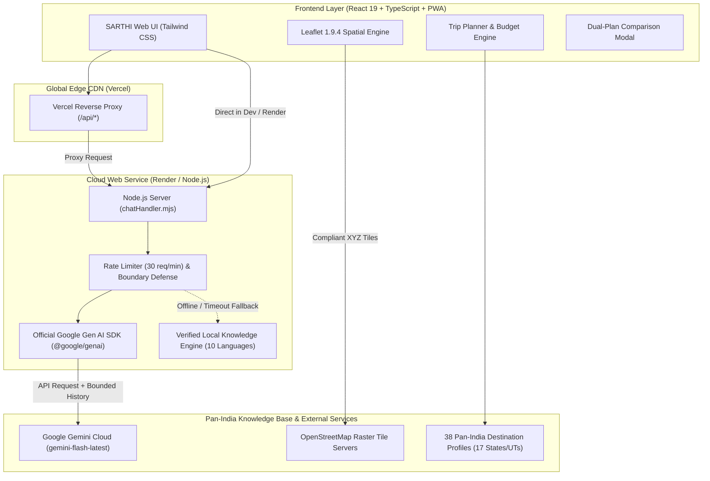

# SARTHI AI — Pan-India Intelligent Sustainable & Cultural Tourism Platform 🌿

[](https://github.com/SyedAsif7/sarthi)
[](https://sarthi-psi.vercel.app)
[](https://sarthi-e23z.onrender.com)
[-success?style=for-the-badge)](https://github.com/SyedAsif7/sarthi)
[](https://www.typescriptlang.org/)
[](https://aistudio.google.com/)
[](https://www.openstreetmap.org/)

> **Mission:** Transform Indian tourism from commercial over-tourism into a community-first, low-carbon, and culturally authentic regenerative model across all 28 States and 8 Union Territories.

---

## 🌐 Live Production Deployments

* **Primary Edge Frontend (Vercel):** [https://sarthi-psi.vercel.app](https://sarthi-psi.vercel.app/)
* **Full-Stack Web Service (Render):** [https://sarthi-e23z.onrender.com](https://sarthi-e23z.onrender.com/)
* **GitHub Repository:** [https://github.com/SyedAsif7/sarthi](https://github.com/SyedAsif7/sarthi)

---

## 🎯 Executive Summary & Problem Statement

### The Problem
Conventional tourism in India is plagued by three critical challenges:
1. **Overtourism & Ecological Strain:** Fragile ecosystems (Himalayas, Western Ghats, Living Root Bridges) suffer from carrying-capacity overruns and plastic waste.
2. **Economic Leakage:** Up to 70% of visitor spending flows to commercial aggregators and external hotel chains rather than local host communities and indigenous artisans.
3. **High Carbon Intensity:** Excessive reliance on private internal combustion vehicles along highway corridors instead of electrified Indian Railway networks and shared transit.

### The SARTHI AI Solution
SARTHI AI integrates an **AI Sustainable Itinerary Engine**, an **Explainable 100-Point SARTHI Impact Score**, a **Dual-Plan Comparison Tool**, and a **22-Language Google Gemini Assistant** to actively steer tourist footfall toward certified community homestays and GI craft clusters.

---

## 🏛️ System Architecture



---

## ✨ Key Features & KALAM STREAM Challenge 2026 Highlights

### 1. 🗺️ AI Sustainable Itinerary Engine
* **Destination Coverage:** Supports custom itineraries across all 28 States and 8 Union Territories.
* **Strict Budget Adherence:** Capped automatically between **86% and 92%** of the user's budget to guarantee a financial emergency savings cushion.
* **Realistic Distance Modeling:** Incorporates topological Haversine calculation with Indian road and railway tortuosity multipliers ($1.25\times$).
* **Explainable Recommendations:** Every activity and dining recommendation details *why* it was selected (carbon efficiency, GI craft preservation, or community benefit).

### 2. ⚖️ Dual-Plan Comparison Tool
Allows travelers to compare their conscious itinerary side-by-side with a conventional commercial baseline:
* **Estimated Total Spend:** Demonstrates cost savings through community homestays.
* **Travel Distance & Mode:** Compares electric railway transit vs. private vehicle highway driving.
* **Sustainability Score:** Clear visual contrast (e.g., Plan A **94/100** vs. Plan B **61/100**).
* **Local Community Retention:** Quantifies revenue staying in host villages (~**96%** in Plan A vs. ~**48%** in Plan B).
* **Cultural Immersion:** Tracks master-artisan touchpoints and heritage workshops.

### 3. 🌿 Explainable SARTHI Impact Score (100 Points)
A multi-criteria heuristic planning index with transparent weights:
* **Environmental Sustainability (30 Pts):** Ecosystem health, plastic-free enforcement, low-impact trails.
* **Local Economic Contribution (25 Pts):** Community homestay revenue retention, farm-to-table dining.
* **Cultural Heritage Engagement (20 Pts):** Living indigenous crafts, GI-tagged heritage, ASI monument integrity.
* **Sustainable Transportation (15 Pts):** Rail connectivity (~28g $\text{CO}_2$/pkm) vs private ICE vehicles (~140g $\text{CO}_2$/pkm).
* **Responsible Tourism Practices (10 Pts):** Regulated visitor density, carrying capacity guidelines, cultural etiquette.
* *Transparency Disclaimer:* Openly identifies heuristics and planning assumptions to prevent misleading claims of certified environmental life-cycle audits.

### 4. 📍 Watermark-Free OpenStreetMap Spatial Layer
* Replaced deprecated Carto tiles with official, 100% compliant **OpenStreetMap raster tiles** (`tile.openstreetmap.org`).
* **38 Custom Destination Pins** categorized by Heritage, Nature, Spiritual, Wildlife, Adventure, and Waterfalls.
* **Dynamic Route Overlays:** Leaflet dashed polylines auto-fit to generated travel waypoints.
* **Mobile Responsiveness:** Container lifecycle resize listeners (`map.invalidateSize()`) eliminate gray tile boundaries on mobile phones and tablets.

### 5. 🤖 Multilingual Google Gemini Travel Assistant
* Powered by the official Google Gen AI SDK (`@google/genai`) using `gemini-flash-latest`.
* Supports all **22 Scheduled Indian Languages + English** with automatic Devanagari, Tamil, Bengali, Gurmukhi, and Telugu script detection.
* **Zero Secret Leakage:** Server-side API key configuration only; excluded from git and client JavaScript bundles.
* **Security Defenses:** Request rate limiting (>30 req/min), 2,000 character boundaries, and prompt-injection defenses.
* **Browser Deep-Linking:** Direct browser navigation to `/api/chat` automatically redirects (HTTP 302) to the assistant UI (`/#/assistant`).

### 6. 📱 Progressive Web App (PWA) & Sharing
* Works offline with service worker caching (`/sw.js`) and mobile install manifest (`/manifest.json`).
* **1-Click WhatsApp Itinerary Share** formatted with route highlights and emergency numbers.
* Downloadable `.txt` dockets and browser-printable travel dossiers.
* Direct access to national helplines: **1363** (24x7 Multi-Lingual Tourist Helpline) and **112** (Emergency).

---

## 🧪 Representative Competition Scenarios Tested

| Scenario | State & Circuit | Duration | Budget | Spend / Savings | Impact Score |
| :--- | :--- | :---: | :---: | :---: | :---: |
| **Scenario 1** | **Rajasthan** (Cultural & Heritage) | 3 Days | ₹15,000 | ₹13,050 / ₹1,950 buffer | **94 / 100** *(Eco Pioneer)* |
| **Scenario 2** | **Kerala** (Nature & Backwaters) | 3 Days | ₹14,000 | ₹12,600 / ₹1,400 buffer | **94 / 100** *(Eco Pioneer)* |
| **Scenario 3** | **Maharashtra** (Heritage & Local) | 3 Days | ₹16,000 | ₹14,250 / ₹1,750 buffer | **94 / 100** *(Eco Pioneer)* |

---

## 📊 Automated Test Suites & Verification

The codebase includes automated test suites covering all platform layers:

```bash
# 1. Test Pan-India Travel Scenarios (Rajasthan, Kerala, Maharashtra)
npx tsx src/test_scenarios.ts      # 3 / 3 PASSED ✓

# 2. Test OpenStreetMap Tiles & Coordinate Integrity
npx tsx src/test_map.ts            # 11 / 11 PASSED ✓

# 3. Test Gemini Chatbot, 10 Languages, Rate Limits & Secrets
npx tsx src/test_chatbot.ts        # 28 / 28 PASSED ✓

# 4. Test Live Cloud Deployments (Render & Vercel)
npx tsx src/test_live_deployments.ts # 15 / 15 PASSED ✓
```

```
================================================================================
TOTAL AUDIT VERIFICATION: 42 / 42 TESTS PASSED (100% SUCCESS RATE)
================================================================================
```

---

## 🚀 Quickstart & Local Installation

### Prerequisites
* Node.js $\ge$ 18.0.0
* npm $\ge$ 9.0.0

### Setup Steps
```bash
# 1. Clone repository
git clone https://github.com/SyedAsif7/sarthi.git
cd sarthi

# 2. Install dependencies
npm install

# 3. Configure environment variables
cp .env.example .env
# Open .env and add your GEMINI_API_KEY from Google AI Studio

# 4. Start local development server
npm run dev
# Open http://localhost:5173/ in your browser

# 5. Build for production
npm run build

# 6. Start production server
npm start
```

---

## 📂 Repository Structure

```
Sarti/
├── api/                       # Vercel serverless integration
├── public/                    # Manifest, service worker, icons
│   ├── manifest.json          # PWA configuration
│   ├── sw.js                  # Service worker offline caching
│   └── sarthi-ai-logo.png     # Brand insignia
├── server/                    # Node.js backend server
│   ├── chatHandler.mjs        # Gemini API integration & rate limiting
│   ├── fallbackChat.mjs       # Pure ES module knowledge engine fallback
│   └── index.mjs              # Production server & static file host
├── src/
│   ├── components/            # InteractiveMap, Navbar, FloatingChatWidget, etc.
│   ├── data/                  # 38 Destinations, 22 Languages, Festivals, Safety
│   ├── pages/                 # HomePage, TripPlannerPage, ExplorePage, ChatAssistantPage
│   ├── services/              # itineraryEngine.ts, chatService.ts
│   ├── utils/                 # impactScore.ts, toast.ts
│   ├── test_scenarios.ts      # Automated scenario validation
│   ├── test_map.ts            # Automated OSM tile verification
│   ├── test_chatbot.ts        # Automated Gemini & security suite
│   └── test_live_deployments.ts # Live cloud audit for Render & Vercel
├── vercel.json                # Vercel reverse proxy configuration
├── vite.config.ts             # Vite dev server middleware
└── package.json               # Scripts & dependencies
```

---

## 📜 License & Acknowledgments
* **Competition:** Developed for the **KALAM STREAM Challenge 2026**.
* **Mapping Data:** &copy; [OpenStreetMap](https://www.openstreetmap.org/copyright) contributors.
* **AI Provider:** [Google Gen AI SDK](https://aistudio.google.com/) (`gemini-flash-latest`).
